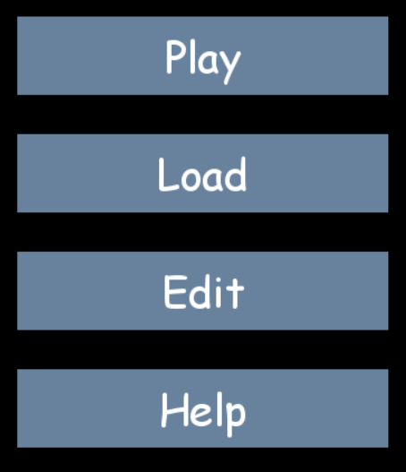
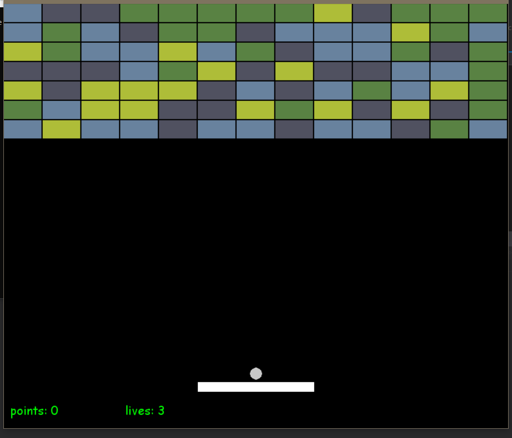

# Projekt z przedmiotu WWWiJS

## Prosty klon gry Arkanoid napisany w języku python

### dokumentacja:
Znajduje się ona pod następującym adresem: https://s29.labwww.pl/arkanoid/index.html

### wymagane modułu zewnętrzne:
- pygame, projekt został storzony na wersji 1.9.6
- math
- random
- time
- piclke

### przygotowanie do uruchomienia:
- sklonować repozytorium
- przejść do folderu 'arkanoid'

### uruchomienie:
Aby włączyć grę w pełni funkcjonalną należy uruchomić bez żadnych dodatkowych atrybutów skrypt o nazwie 'main\_menu\_module.py'. Daje on dostęp do zaczęcia rozgrywki, wczytania poziomu, edytora oraz ekranu pomocy.

Alternatywą jest uruchomienie pliku 'arkanoid\_module.py'. Zawiera on jedynie rozgrywkę. Bez menu, edytora i wczytywania.

### krótkie omówienie:
Po odpaleniu 'main\_memu\_module.py' powinien być widoczny poniższy interfejs
\n
wybranie opcji 'Play' uruchamia rozgrywkę na losowo wygenerowanym poziomie
\n

### opis funkcjonalności:
- konfiguracja za pomocą pliku tekstowego (1 pkt)
- możliwość generowania losowego poziomu lub wczytanie go z pliku (1 pkt)
- odwzorowanie fizyki ruchu piłki (1 pkt)
- sterowanie za pomocą strzałek (1 pkt)
- power-upy (1 pkt)
- dźwięki (1 pkt)
- licznik punktów i żyć, pauza, nowa gra (1 pkt)
- szybki zapis i wczytywanie go po naciśnięciu odpowiednich klawiszy (1 pkt)

- instrukcja uruchomienia i obsługi (1 pkt)
- dokumentacja kodu źródłowego (komentarze) i jego jakość (1 pkt)
