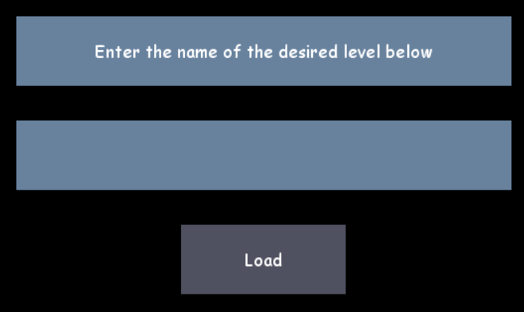
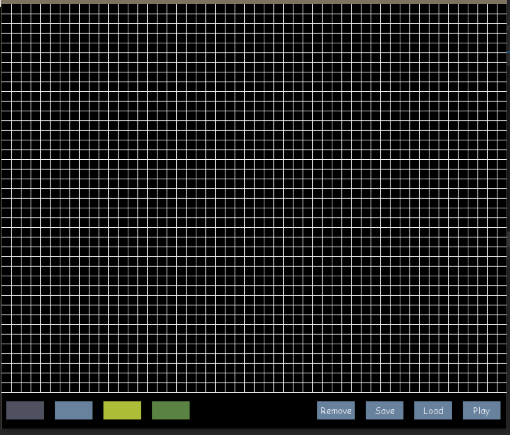
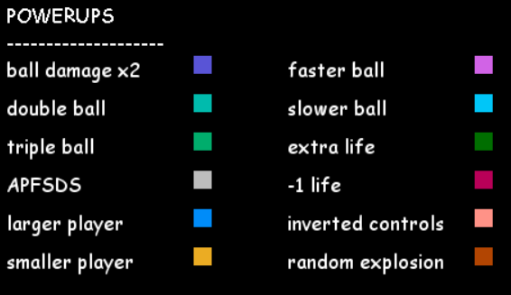
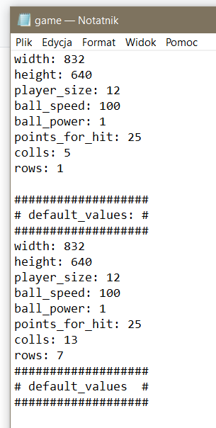

# Projekt z przedmiotu WWWiJS

## Prosty klon gry Arkanoid napisany w języku python

### dokumentacja:
Znajduje się ona pod następującym adresem: https://s29.labwww.pl/arkanoid/index.html

### wymagane moduły:
- pygame, projekt został storzony na wersji 1.9.6
- math
- random
- time
- piclke

### przygotowanie do uruchomienia:
- sklonować repozytorium
- przejść do folderu 'arkanoid'

### uruchomienie:
Aby włączyć grę w pełni funkcjonalną, należy uruchomić bez żadnych dodatkowych atrybutów skrypt o nazwie 'main\_menu\_module.py'. Daje on dostęp do zaczęcia rozgrywki, wczytania poziomu, edytora oraz ekranu pomocy.

Alternatywą jest uruchomienie pliku 'arkanoid\_module.py'. Zawiera on jedynie rozgrywkę. Bez menu, edytora i wczytywania.

### krótkie omówienie:
Po odpaleniu 'main\_memu\_module.py' powinien być widoczny poniższy interfejs

 
Wybranie opcji 'Play' uruchamia rozgrywkę na losowo wygenerowanym poziomie

 
dostępne klawisze to:
- 'spacja': rozpoczęcie rozgrywki/wznowienie
- 'lewa strzałka': ruch gracza w lewo
- 'prawa strzałka': ruch gracza w prawo
- 'p': pauza
- 's': szybki zapis
- 'l': szybkie wczytanie
- 'n': nowa gra
- 'escape': powrót do menu głównego

Menu wczytywania poziomu

 
dostępne klawisze to:
- 'escape': powrót do menu głównego oraz zakończenie wpisywania
- 'enter': zakończenie wpisywania

Edytor poziomów

 
dostępne klawisze
- 'c': anulowanie wybranego bloku
- 'escape': powrót do menu głównego

Po przejściu losowo wygeneorwanego poziomu, paleta kolorów bloków jest odwracana, poziom jest generowany ponownie, a graczowi doliczane są 3 życia.

Po ukończeniu wczytanego poziomurozgrywka nie jest kontynuowana.

Po utracie wszystkich żyć, generowany jest nowy poziom. W przypadku wczytywanych poziomów rozgrywka wraca do stanu początkowego - wczytany poziom.

Co jakiś czas po zniszczeniu cegiełki zostanie upuszczona losowa znajdźka. W sumie jest ich 12 rodzajów, są to:

 

Plik konfiguracyjny nazywa się 'game.cfg'

 
dostępne parametry:
- szerokość okna w pikselach
- wyskość okna w pikselach
- rozmiar (długość) gracza w blokach 16 x 16 pikseli
- prędkość piłki wyrażona w procentach, limit 200%
- obrażenia zadawane przez piłkę
- ilość punktów przyznawana graczowi za trafienie w blok
- ilość kolumn do losowego generowania poziomu
- ilość rzędów do losowego generowania poziomu

Stworzone poziomy przechowywane są w folderze 'levels'

### opis funkcjonalności:
- konfiguracja za pomocą pliku tekstowego (1 pkt)
- możliwość generowania losowego poziomu lub wczytanie go z pliku (1 pkt)
- odwzorowanie fizyki ruchu piłki (1 pkt)
- sterowanie za pomocą strzałek (1 pkt)
- power-upy (1 pkt)
- dźwięki (1 pkt)
- licznik punktów i żyć, pauza, nowa gra (1 pkt)
- szybki zapis i wczytywanie go po naciśnięciu odpowiednich klawiszy (1 pkt)

- instrukcja uruchomienia i obsługi (1 pkt)
- dokumentacja kodu źródłowego (komentarze) i jego jakość (1 pkt)
